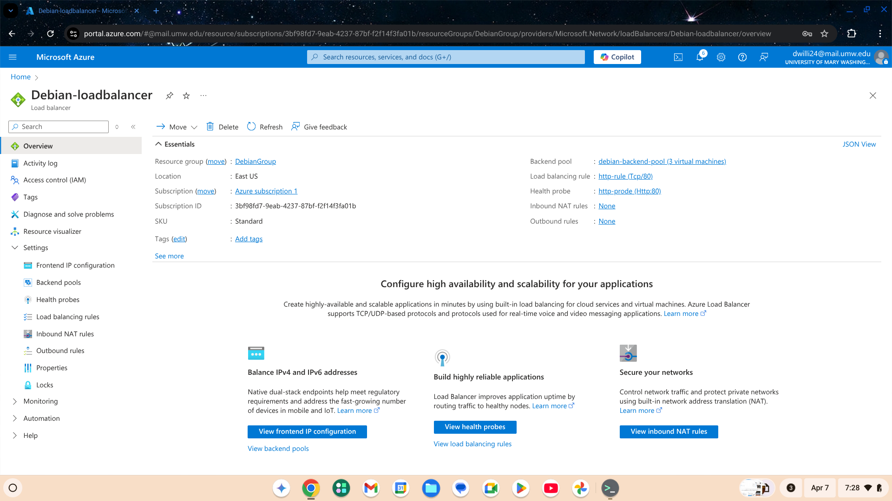
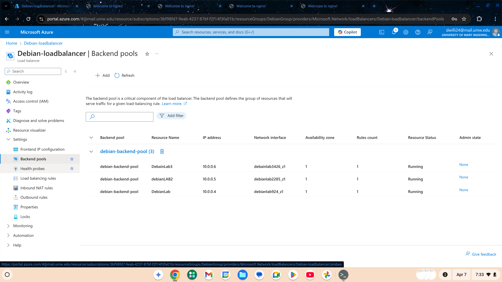
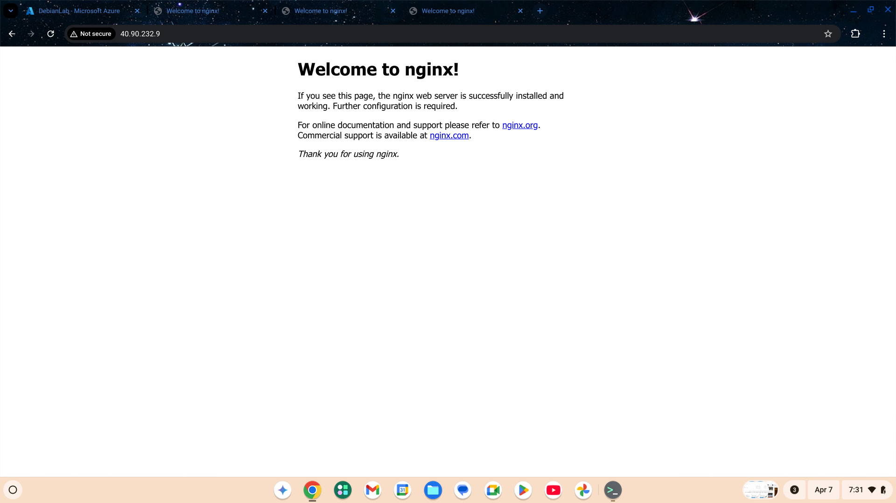
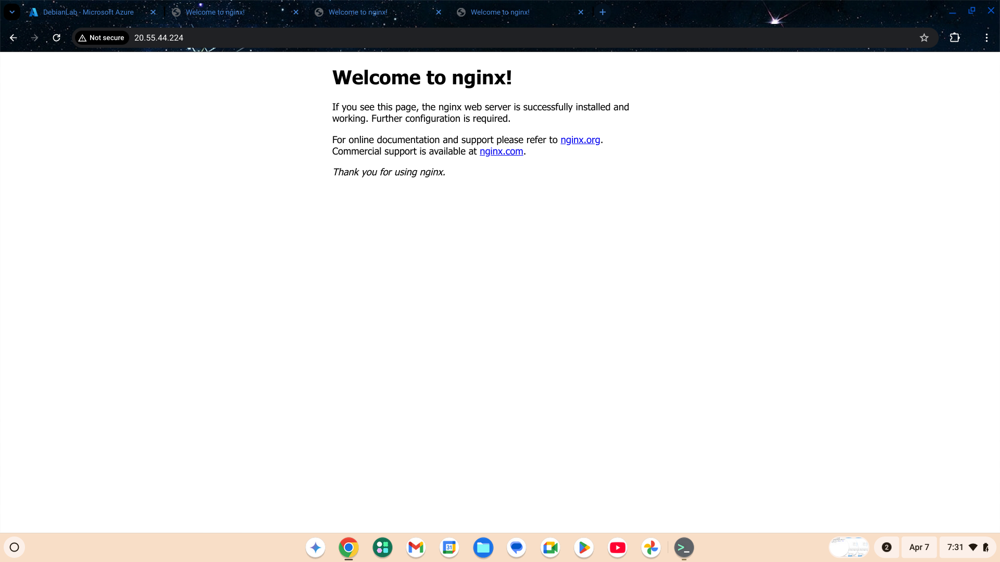
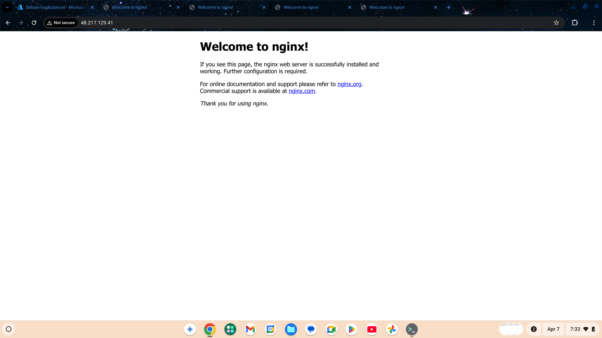

# azure-load-balancer-project
Highly available web app on Azure with 3 Linux VMs, Nginx, and a Load Balancer.
# Azure Load Balanced Web Application Project

## Project Overview
Deployed a highly available web application on Microsoft Azure using three Debian Linux virtual machines (VMs) with Nginx web servers. Configured an Azure Standard Load Balancer to distribute HTTP traffic across the VMs, ensuring high availability and scalability.

## Technologies Used
- Microsoft Azure
- Linux (Debian)
- Nginx Web Server
- Azure Load Balancer (Standard SKU)
- Network Security Groups (NSG)

## Architecture Diagram

## Project Steps
1. Created three Debian VMs on Azure.
2. Installed Nginx web server on each VM.
3. Configured Azure Load Balancer with frontend public IP and backend pool.
4. Set up health probes and load balancing rules for HTTP traffic.
5. Secured VMs with NSG rules allowing only SSH and HTTP traffic.
6. Verified successful load balancing by accessing the public IP.

## Live Demo
Visit the web application:  
48.217.129.41 (Debian-lb-pip)
## Screenshots

 Azure Load Balancer Overview

 Backend Pool with 3 VMs

 VM Public IP - Nginx Welcome Page (VM 1)

VM Public IP - Nginx Welcome Page (VM 2)

VM Public IP - Nginx Welcome Page (VM 3)

Load Balancer Public IP - Nginx Welcome Page

